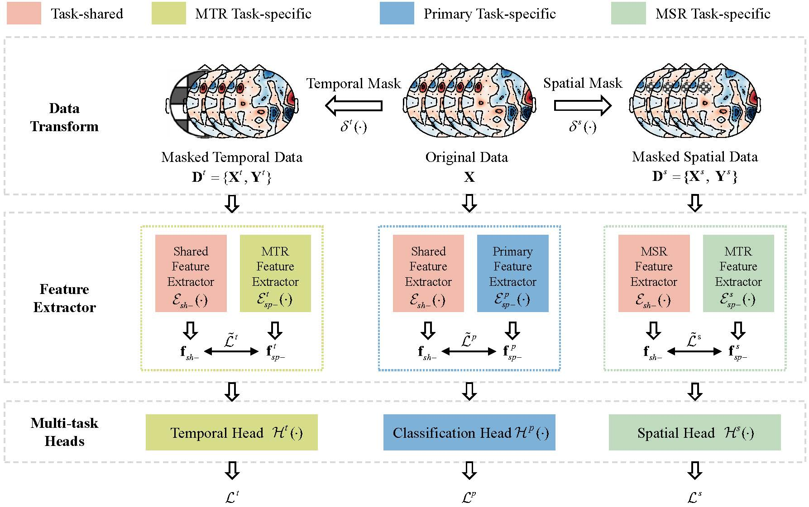

## Multi-Task Collaborative Network: Bridge the Supervised and Self-Supervised Learning for EEG Classification in RSVP tasks
Created by Hongxin Li, Jingsheng Tang, Wenqi Li, Wei Dai, Yaru Liu, and Zongtan Zhou from National University of Defense Technology.



## Introduction
This work is under review. Electroencephalography (EEG) datasets are characterized by low signal-to-noise signals and unquantifiable noisy labels, which hinder the classification performance in rapid
serial visual presentation (RSVP) tasks. Previous approaches primarily relied on supervised learning (SL), which may result in overfitting and reduced generalization performance. In this paper, we propose a novel multi-task collaborative network (MTCN) that integrates both SL and self-supervised learning (SSL) to extract more generalized EEG representations. The original SL task, i.e., the RSVP EEG classification task, is used to capture initial representations and establish classification thresholds for targets and non-targets. Two SSL tasks, including the masked temporal/spatial recognition task, are designed to enhance temporal dynamics extraction and capture the inherent spatial relationships among brain regions, respectively. The MTCN simultaneously learns from multiple tasks to derive a comprehensive representation that captures the essence of all tasks, thus mitigating the risk of overfitting and enhancing generalization performance. Moreover, to facilitate collaboration between SL and SSL, MTCN explicitly decomposes features into task-specific features and task-shared features, leveraging both label information with SL and feature information with SSL. Experiments conducted on THU, CAS, and GIST datasets illustrate the significant advantages of learning more generalized features in RSVP tasks. 


## Installation

```txt
python >= 3.6
torch >= 1.7.0
numpy >= 1.20
tqdm >= 4.59.0
scipy >= 1.6.2
```

## Usage

1. modified the config file

   ```json
    {
        "DatasetName": ["CAS", "THU", "GIST"],
        "Dataset": {
            
            "CAS": {
                "subject_num": 14
            },
            "THU": {
                "subject_num": 64
            },
            "GIST": {
                "subject_num": 55
            }
        },
        "TrainPara":{
            "batch_size": 32,
            "epoch": 60
        },
        "TestPara":{
            "batch_size": 32,
            "epoch": 1
        }
    }

   ```
2. Train model

   ```cmd
   python main.py
   ```


## Citation